# Fortized design system

> **Generated by `node tools/gen-design-system.mjs`. Do not edit by hand.**
> The source is the component registry in `app/kit/kit.js`, which also drives the
> live kit at `/app/__kit` (set `FTZ_KIT=1` to serve it). One registry, so the doc
> and the page cannot disagree.

**If a component is not on this page, it does not exist.** New surfaces get built
out of what is here. Inventing a class is how we ended up with six competing
visual languages and a user telling us the design does not match.

_18 components · 42 documented states · `app/styles.css` parses to 10713 rules._

## The rules

These are not preferences. A component that breaks one of them is a bug.

| Rule | Why |
| --- | --- |
| Icons are **inlined FontAwesome solid SVG paths** via `_faIcon`, never `<i class="fa-…">` | FontAwesome is a CDN dependency; an icon that fails to draw is a broken control |
| Never an **emoji as an icon** | An OS emoji is a different typeface on every machine and cannot take our colours |
| Controls are **ours**: `_ftzCheckHTML` · `_stfStep` · `_ftzColorPop` · `.ftz-select` · `_stfCal` | A native checkbox, spinner, colour dialog or select is the OS design, not ours |
| Thick strokes are **`var(--border)`** | `var(--ink)` is the 3D *button* edge and nothing else |
| **No glows.** No coloured blur halo, anywhere | Standing, non-negotiable. A neutral black drop shadow for depth is fine |
| **Syne ≤ 700** for anything titled | 800 reads as shouty; the codebase is full of legacy 800s and they get dialled down on contact |
| **No em dashes** in user-facing copy | Use a middot. Em dashes read as AI-written |
| Every colour comes from a **token** | The appearance system rewrites the tokens at runtime; a hardcoded hex stops recolouring |
| Big cards close with **`.settings-close`**, small cards with **`.ftz-close-btn.ftz-ac-x`** | One convention, so the way out of a card is always where you expect |
| `animation-fill-mode: backwards`, never `both` | `both` keeps the final keyframe forever and silently swallows the `:hover` lift |

## Contents

**Buttons** · [3D button](#3d-button) · [Round icon control](#round-icon-control) · [Close button](#close-button)
**Controls** · [Checkbox](#checkbox) · [Stepper](#stepper) · [Colour picker](#colour-picker) · [Dropdown](#dropdown) · [Text field](#text-field) · [Toggle](#toggle)
**Surfaces** · [Panel](#panel) · [Section head](#section-head) · [Page topbar](#page-topbar) · [Card footer](#card-footer)
**Status** · [Pill](#pill) · [Empty state](#empty-state)
**Foundation** · [Colour tokens](#colour-tokens) · [Radii, type and motion](#radii-type-and-motion) · [Icons](#icons)

## Buttons

### 3D button

`.fs-btn`

The one button recipe. Rest 0 4px 0 0 var(--ink) · hover translateY(-1px) + 0 5px · press translateY(3px) + 0 1px · border 2px solid var(--ink) · radius pinned across every state so a press can never square it off. Variants change the FILL ONLY, never the geometry.

**States:** `Default` · `Primary` · `Light` · `Danger` · `Good` · `Small` · `Disabled` · `With an icon`

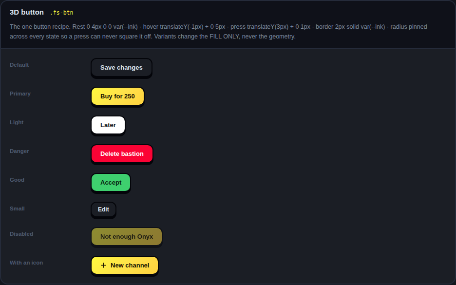

### Round icon control

`.fr-act`

A round control for a single action beside a row: accept, decline, more. Stays a circle in every state — do not let a hover or press rewrite border-radius.

**States:** `Neutral` · `Accept` · `Danger`

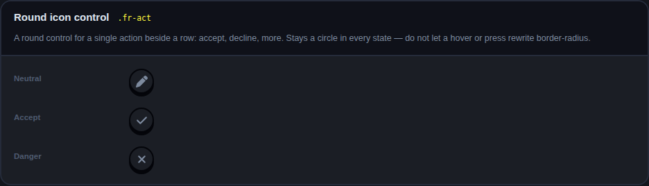

### Close button

`.ftz-close-btn.ftz-ac-x`

SMALL cards close with this. BIG cards close with .settings-close. The glyph is an inline FA xmark, never <i class="fa-…"> — the one control that must never fail to draw cannot depend on a CDN.

**States:** `On a card`

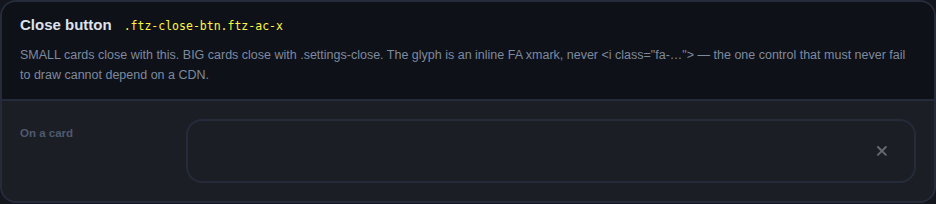

## Controls

### Checkbox

`_ftzCheckHTML() · .ftz-chk`

THE checkmark. Circular, accent fill, the tick pops in — the one from the Gift Radiance card. Every checkbox in the platform is this one, including bare <input type="checkbox"> which is skinned at element level so old markup gets it for free.

**States:** `On / off` · `With a description` · `Disabled` · `Card` · `Card, danger` · `Bare input (legacy markup)`

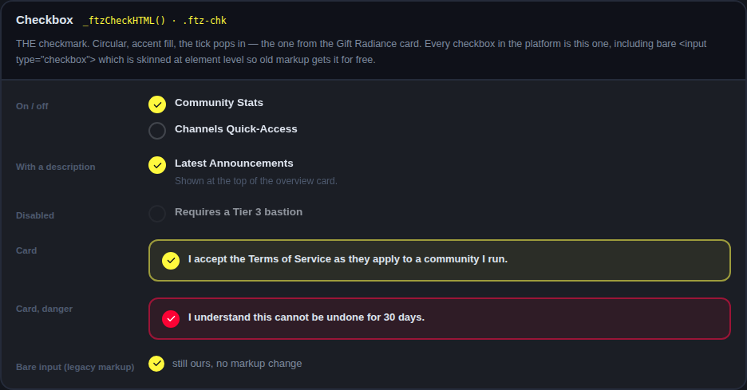

### Stepper

`_stfStep() · .stf-step`

Numbers. Our arrows, not the browser spinner. Refuses any non-digit keystroke, allowing a minus only when min<0 and a dot only when step<1. There is no reason left to write <input type="number">.

**States:** `Days` · `Onyx` · `At its floor`

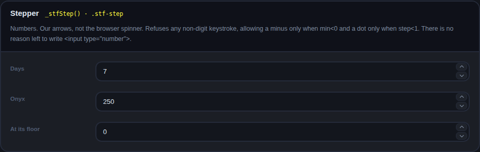

### Colour picker

`_ftzColorFieldHTML() · _ftzColorPop()`

HSV square, hue track, hex field, eyedropper, presets, and a live preview chip that updates on EVERY drag frame — a 6px crosshair is not a preview. Auto-flips if it would open off-screen. Replaces <input type="color"> everywhere; the OS dialog is not our design.

**States:** `Closed`

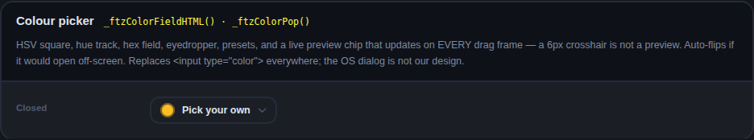

### Dropdown

`_ftzSelectHTML() · .ftz-select`

Ours: a button plus our own popover, with a tick on the chosen row. ⚠️ The handler is _fn(__VALUE__) and never _fn('__VALUE__') — _ftzSelectPick substitutes a JSON string, quotes included. The chosen value lives in a hidden input with the same id, so getElementById(id).value still works.

**States:** `Closed`

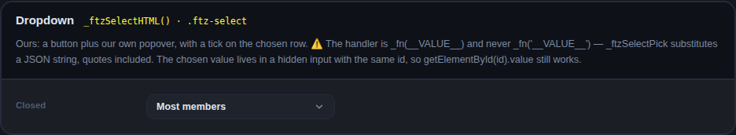

### Text field

`.settings-input`

The app-standard field: Display Name, Pronouns, and every field built since. ⚠️ It must STAY ROUND on focus — three global rules fight over a focused input and none of them pinned the radius, which is why fields used to go square when clicked.

**States:** `Empty` · `Filled` · `Textarea` · `Disabled`

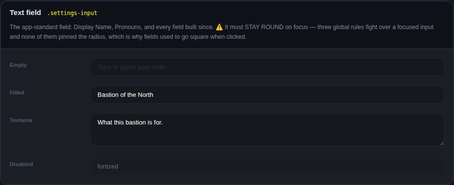

### Toggle

`.toggle`

For a setting that takes effect immediately. A checkbox is for something you then Save. ⚠️ No glow: .toggle.on used to carry an accent halo and it is overridden to none.

**States:** `Off` · `On`

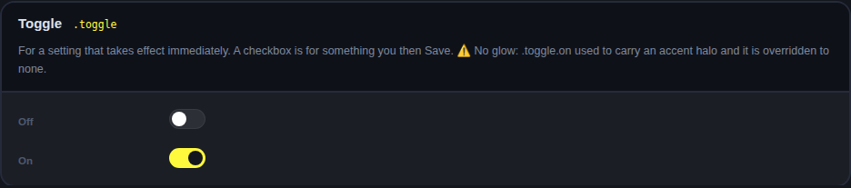

## Surfaces

### Panel

`.fs-tb-panel`

The default block of content. 2px var(--border) on var(--panel). ⚠️ Thick strokes are var(--border) — var(--ink) is the 3D BUTTON edge and nothing else.

**States:** `Plain`

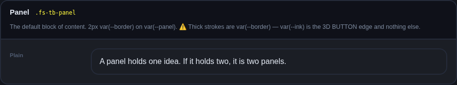

### Section head

`.qst-group`

Separates stacked sections inside a page. Uppercase, tracked, muted. Not a page title — that belongs in the topbar.

**States:** `Plain` · `With a note`

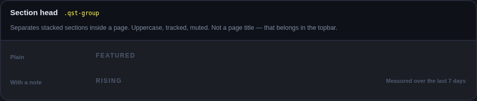

### Page topbar

`.disc-subnav`

Every page wears this: mark, title, separator, then icon-less tabs, then actions pushed right. Discover, Fortshop, Quests, Radiance, Friends and the staff console all use it, which is why they read as one app.

**States:** `Tabs + an action`

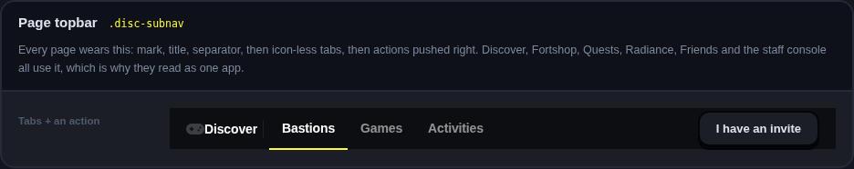

### Card footer

`.ftz-modal-foot`

The action row at the bottom of a card. Cancel left of confirm, confirm carries the weight.

**States:** `Two actions`

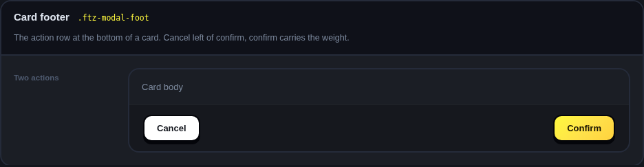

## Status

### Pill

`_stfPill() · .stf-pill`

A one-word state on a row: a tier, a verdict, a status. Not a button — a pill is never clickable.

**States:** `Every tone`

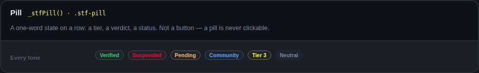

### Empty state

`_ftzNotFound() · .ftz-nf`

Heroic Search. Every empty surface uses it and every one says the REAL reason — "hide joined emptied this shelf" is not the same as "this shelf is empty". ⚠️ Not every empty state is a failure: inbox zero and a clean record are WINS and take the celebrate art, not the defeated knight.

**States:** `Nothing found` · `A win` · `Not started yet` · `Compact`

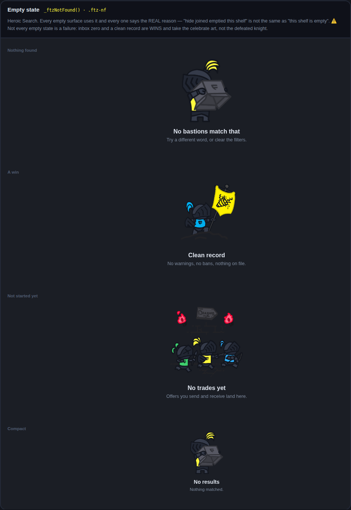

## Foundation

### Colour tokens

`:root`

Every colour in the platform comes from here. A hardcoded hex in a component is a bug: the appearance system rewrites these tokens at runtime, so anything hardcoded simply stops recolouring.

**Tokens:** `--bg` · `--bg2` · `--rail` · `--sidebar` · `--channel` · `--panel` · `--panel2` · `--panel3` · `--border` · `--text` · `--muted` · `--muted-light` · `--accent` · `--ink` · `--green` · `--red` · `--yellow` · `--blue` · `--purple` · `--gold`

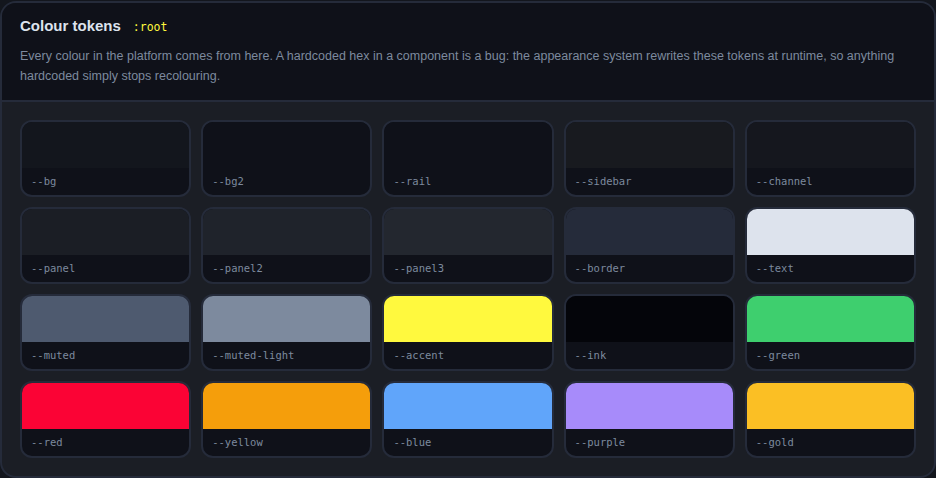

### Radii, type and motion

`var(--radius-*) · var(--font-*) · var(--ease-out)`

Radii 8 / 12 / 16 / 22 / pill. Syne for anything titled at weight ≤700 — never 800, the codebase is full of legacy 800s and they get dialled down whenever a component is touched. One easing curve, --ease-out.

**States:** `Radii` · `Syne` · `Body`

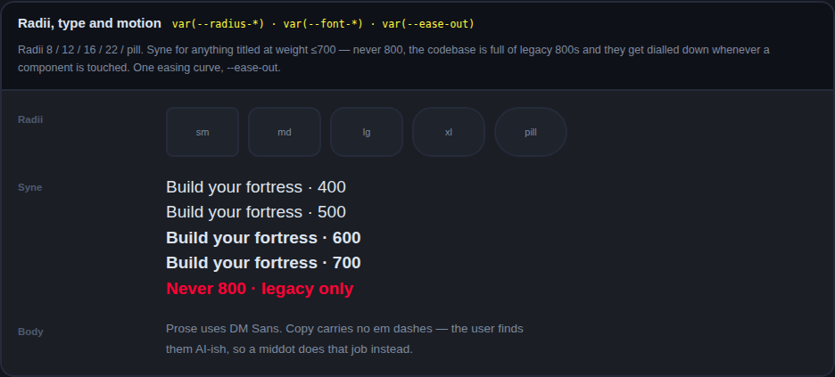

### Icons

`_faIcon() · _FA_ICON_PATHS`

Filled FontAwesome solid paths, INLINED. Never <i class="fa-…">: FontAwesome is a CDN dependency and an icon that fails to draw is a broken control. Never an OS emoji as an icon. The registry below is everything currently inlined — see docs/design-system.md for the conversion backlog.

**48 icons currently inlined:** `id-card` · `user-gear` · `key` · `bell` · `microphone` · `palette` · `keyboard` · `language` · `gamepad` · `user-plus` · `circle-info` · `logout` · `link` · `house` · `hashtag` · `shield` · `face-smile` · `clipboard` · `users` · `ban` · `robot` · `clock` · `file-lines` · `bullhorn` · `chart-line` · `star` · `heart` · `medal` · `trash` · `chevron-up` · `chevron-down` · `community` · `upload` · `pen` · `rotate-right` · `flip` · `plus` · `minus` · `reset` · `image` · `crop` · `check` · `xmark` · `crown` · `eye` · `calendar` · `lock` · `bolt`

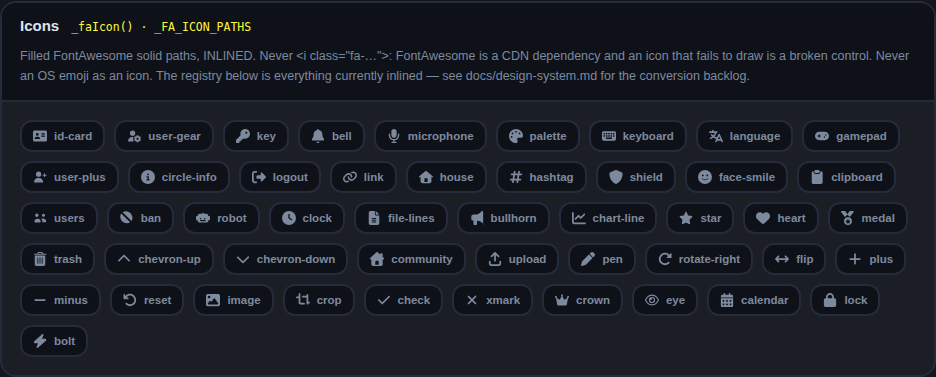

## Where the debt is

The kit is clean because the kit only contains components that have been rebuilt.
The rest of the platform has not, and pretending otherwise is how a design doc
starts lying. These are the live counts from `tools/check-icons.mjs` and
`tools/check-tokens.mjs`. Every phase of the rework brings them down.

### Icons

```
Icon registry: 48 glyphs inlined.

✓ Every _faIcon() call names a glyph that exists.

✗ 114 emoji used where an icon belongs:
    app/app.js:5403  🎵  iconEl.innerHTML = '<span style="font-size:11px;">🎵</span>';
    app/app.js:6910  🏰  <span class="bd-icon">🏰</span> Open Bastion
    app/app.js:6916  🔗  <span class="bd-icon">🔗</span> Invite Friends
    app/app.js:6922  ⚙️  <span class="bd-icon">⚙️</span> Settings
    app/app.js:6925  🚪  <span class="bd-icon">🚪</span> Leave Bastion
    app/app.js:7027  🧭  <div style="font-size:28px;margin-bottom:10px;">🧭</div>
    app/app.js:7220  👏  <span class="hwr-stat"><span class="hwr-stat-ico">👏</span> ${net.toLocaleString()}</span>
    app/app.js:7612  👥  container.innerHTML = '<div class="ftz-empty"><div class="ftz-empty-icon">👥</div><div class="ftz-empty-title"
    app/app.js:8789  💬  html += '<div class="ftz-empty" style="padding:24px 14px;"><div class="ftz-empty-icon">💬</div><div class="ftz
    app/app.js:10189  ✕  return `<span class="nm-chip">${escapeHTML(dn)}<button onclick="event.stopPropagation();_toggleNewMsgMember('$
    app/app.js:10500  ✕  ${isOwner && m!==CU.username ? `<button onclick="event.stopPropagation();kickFromGC('${escapeHTML(meta.id)}','
    app/app.js:11660  🔗  <div class="bnd-action" onclick="closeBastionNameDD();showBastionInviteUI()"><span class="bnd-icon">🔗</span> 
    app/app.js:11662  ➕  ${(isOwner||hasPerm('manage_channels'))?`<div class="bnd-action" onclick="closeBastionNameDD();showCreateRoomM
    app/app.js:11663  📋  ${isOwner?`<div class="bnd-action" onclick="closeBastionNameDD();openBastionSettings('templates')"><span class
    app/app.js:11664  ⚙️  ${isOwner?`<div class="bnd-action" onclick="closeBastionNameDD();openBastionSettings()"><span class="bnd-icon"
    app/app.js:11665  🚪  <div class="bnd-action danger" onclick="closeBastionNameDD();openModal('modal-leave-bastion')"><span class="bn
    app/app.js:11834  🔞  <div style="font-size:56px;margin-bottom:18px;filter:blur(3px);">🔞</div>
    app/app.js:15402  ★  toggle.innerHTML = '<span style="color:var(--accent);margin-right:3px;">★</span> Super';
    app/app.js:17660  ✨  <div style="font-size:36px;margin-bottom:12px;">✨</div>
    app/app.js:20279  🔗  <span class="tli-icon">🔗</span>
    … and 94 more

FontAwesome CSS-class backlog: 322 site(s) across 113 glyph(s).
  Each is a <i class="fa-…"> that must become an inlined _faIcon() path.
  Converting one needs the real FA path data, which is not in this repo and
  cannot be fetched here (the CDN is blocked by egress policy), so these are
  converted phase by phase as each surface is rebuilt.

  25 of them can be converted RIGHT NOW — their path is
  already in the registry, so it is a pure markup swap:
    ban · bell · bolt · bullhorn · check · chevron-down · circle-info · clock · crown · eye · face-smile · id-card · image · link · lock · minus · pen · plus · robot · shield · star · trash · user-plus · users · xmark

  Most-used, i.e. worth having the path data for first:
    xmark (15) · chevron-right (12) · circle-info (11) · circle-check (11) · check (10) · shield-halved (8) · magnifying-glass (8) · clock (7) · arrow-right (7) · user-group (6) · bolt (6) · plus (6)

114 violation(s). Run with --strict to fail on them.
```

### Colour tokens, type weight and glows

```
app/styles.css · hardcoded colour literals outside :root

  total                          3226    =
  hex                            706     =
  neutral #fff / #000            636     =
  rgb / rgba                     1884    =
  hsl                            0     
  font-weight 800/900            464     =
  coloured shadow declarations   153     =

  Coloured shadows — a coloured blur halo, banned outright.
  ⚠️ These are DECLARATIONS, not computed styles: some are already dead,
     overridden later in the cascade (the notification badges, for one).
     A dead declaration is still debt — the next person who edits that rule
     re-enables a glow without meaning to. Retire them, do not just override.
    styles.css:64  0 2px 8px rgba(251,3,53,.5)
    styles.css:91  0 2px 8px rgba(251,3,53,.5)
    styles.css:499  0 4px 16px rgba(254,248,61,.08)
    styles.css:524  0 0 20px rgba(255,249,62,.15)
    styles.css:539  0 0 10px rgba(62,207,110,.6)
    styles.css:539  0 0 20px rgba(62,207,110,.2)
    styles.css:540  0 0 10px rgba(62,207,110,.6)
    styles.css:540  0 0 20px rgba(62,207,110,.2)
    styles.css:541  0 0 14px rgba(62,207,110,.8)
    styles.css:541  0 0 28px rgba(62,207,110,.3)
    styles.css:545  0 0 8px rgba(255,249,62,.03)
    styles.css:719  0 0 6px rgba(255,249,62,.2)
    … and 141 more

Baseline stamped 2026-08-22. It may only ever go down.
```

## Self-check

The kit asserts its own rules against what the components actually rendered.
A non-zero count fails the generator, so this doc can only exist while it is clean.

| Check | Count |
| --- | --- |
| faClassIcons | 0 |
| nativeNumber | 0 |
| nativeColor | 0 |
| nativeCheckboxUnskinned | 0 |
| emojiAsIcon | 0 |
| missingHelpers | 0 |

